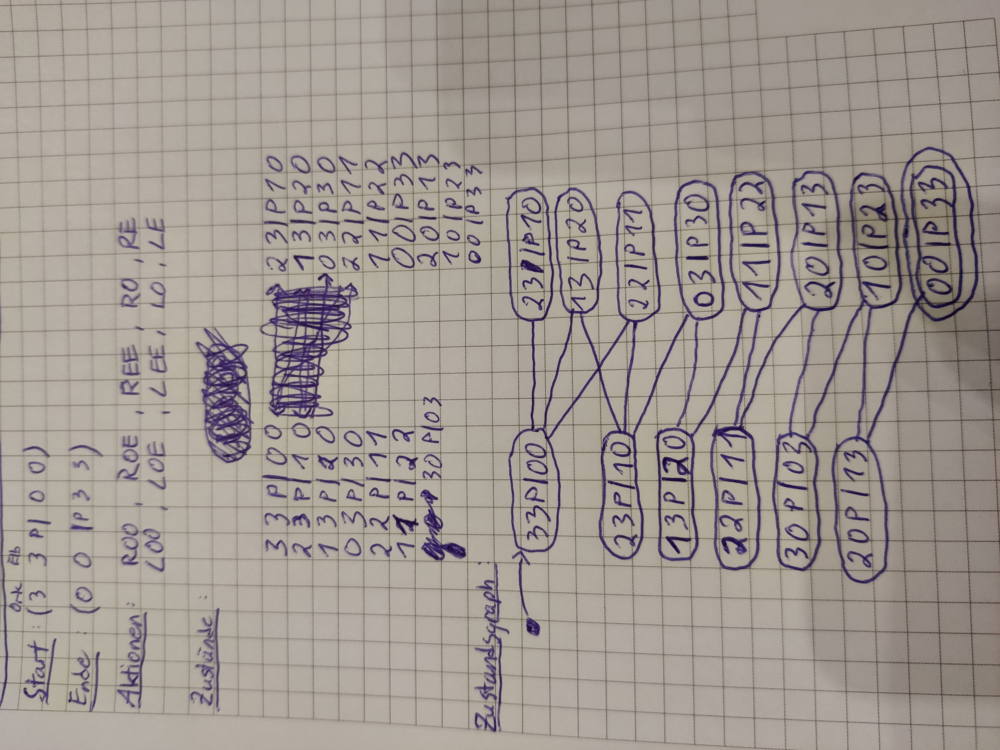

## Aufgabe 1 - Möglichkeiten und Grenzen der KI

|Problem|Lösbar?|Inwiefern?|
|-------|-------|----------|
|Spielen der Brettspiele Dame und Co.|Ja|Besser als die Weltmeister|
|Echtzeit-Übersetzungen von Sprache aus dem Englischen ins Deutsche|Ja|Google's live camera translation|
|Autonomie unbemannter Fahr- und Flugzeuge|Ja|Tesla|
|Ausräumen des Geschirrspülers|Ja|Siehe Vorlesung|
|Automatische Gesichtserkennung|Ja|China, usw.|
|Tischfußballspielen durch einen Roboter|Ja|Ziemlich gut -> Hannover Messe|
|Komponieren von Musik|Ja|Gibt's auf jeden Fall genug Beispiele zu|

## Aufgabe 2 - Auswirkung der KI

#### Chancen

- Weniger Unfälle
- Weniger Staus
- Effizientere Fahrt

#### Risiken

- Trainieren einer KI basierend auf Korrelationen, nicht Kausalitäten
- Trainieren einer KI mit schlechten Daten

#### Ethik

- Wer ist Schuld wenn eine selbst fahrendes Auto jemanden tötet?

  - Die Programmierer?

  - Die Vertreiber?

  - Mitfahrer?

    

## Aufgabe 3 - Turing Test

Bot: https://www.cleverbot.com/

Ich: Hi how are you.  
Bot: I'm good how about you.  
Ich: Good, my name is hannes, whats yours.  
Bot: I already told you, it's Faith.  

Der Bot hat mir davor gar nichts gesagt, Test beendet.

## Aufgabe 4 -  Problemformalisierung, Zustandsraum 

