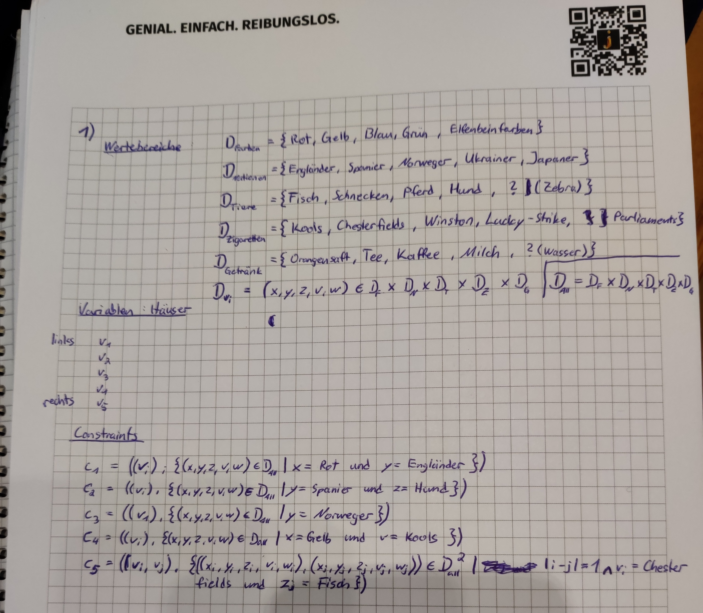
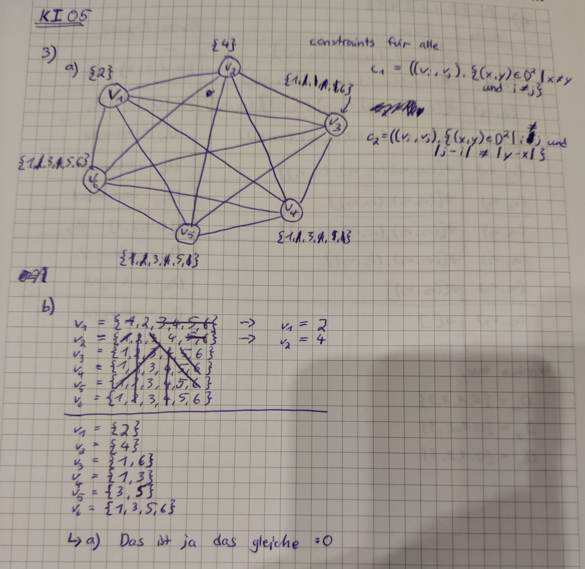
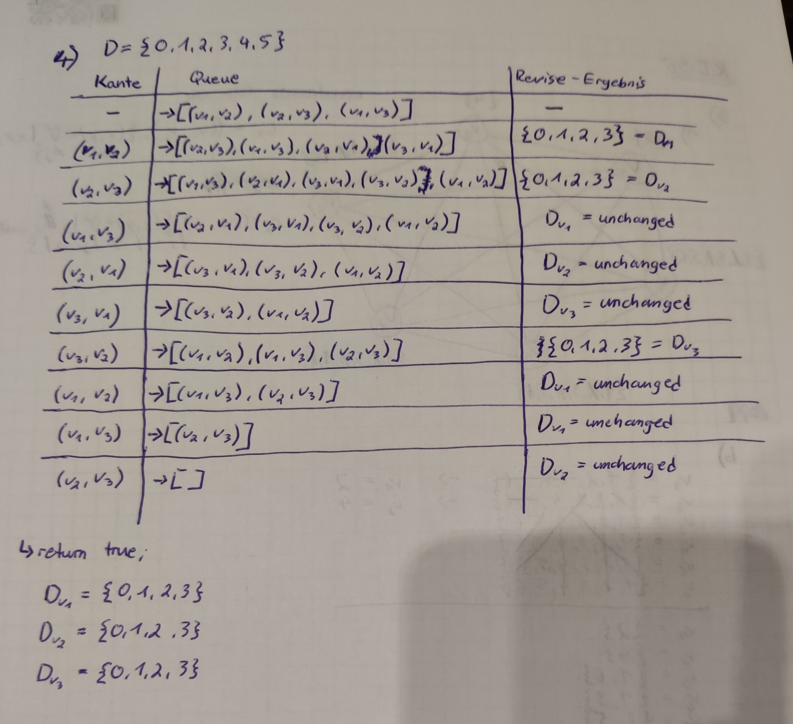

# KI Blatt 05


### Aufgabe 1 - Logikrätsel




### Aufgabe 2 - Framework für Constraint Satisfaction

Lösung:

```
House 1: HouseConfiguration [color=Yellow, nation=Norway, animal=Fish, cig=Kools, drink=Water]
House 2: HouseConfiguration [color=Blue, nation=Ukraine, animal=Horse, cig=Chesterfields, drink=Tea]
House 3: HouseConfiguration [color=Red, nation=England, animal=Snail, cig=Winston, drink=Milk]
House 4: HouseConfiguration [color=Elfenbeinfarben, nation=Spain, animal=Dog, cig=LuckyStrike, drink=OrangeJuice]
House 5: HouseConfiguration [color=Green, nation=Japan, animal=Zebra, cig=Parliaments, drink=Coffee]
```


Aber ohne Glück schreckliche Laufzeit:

```
At try: 452000
```


### Aufgabe 3 - Forward Checking und Kantenkonsistenz




### Aufgabe 4 - Kantenkonsistenz mit AC-3



